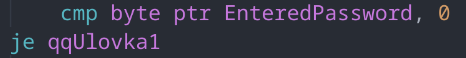

# Свой crackme

Задача заключалась в написании программы на ассемблере под ОС MS-DOS для взлома. В ней нужно было предусмотреть 2 уязвимости: легкую и сложную. Пользователю даётся только исполняемый файл ```vzlom.com```.

## Работа программы

Пользвателю выводятся приветственные сообщения и после предлагается ввести пароль. Если пароль совпал с тем, что лежит в переменной, тогда выводиться сообщение ```SOSAL```, что означает об успешном завершении программы. В протвном случае выводиться ```NE SOSAL LOX```.

Стоит уточнить, что в условиях было оговорено о непосредственном взломе программы, а просто подсмотреть правильный пароль является тривиальной задачей.

## Лёгкая уязвимость

Для её решения стоит лишь пристально посмотреть дизассемблер программы, чтобы найти данную строчку

По этой метке счётчик, который используется для проверки пароля, обнуляется, а далее идёт прыжок на место проверки данного счётчика на ноль. Соответственно достаточно ввести в пароль нулевой байт. В MS-DOS это делается на комбинацию клавиш ```Ctrl+@```.

## Тяжёлая уязвимость

Для более изощрённого способа взлома нужно будет 
написать вспомогательную программу. 
При выводе текста используются функции DOS и 
вызывается 09h функция прерывания под номер 21h. 
Нужно написать резидентную программу,
которая вешается на данное прерывание, 
считает количество вызовов данной функции и на 3-ем
вызове меняет IP из стэка на равное месту, где 
выводиться положительный ответ.

```asm
.model tiny
.186
.code
org 100h

Main:
    mov ax, 0h
    mov es, ax
    mov bx, 21h*4

    cli                                 ; Start of changing

    mov ax, word ptr es:[bx]
    mov RealDOSOfs, ax
    mov ax, word ptr es:[bx+2]
    mov RealDOSSeg, ax                  ; Save the address of previous Time Controller
    mov es:[bx], offset DOSint
    mov es:[bx+2], cs                   ; Load the address of my Time Controller

    sti                                 ; End of changing

    mov ax, 3100h
    mov dx, offset EndLabel
    shr dx, 4
    inc dx
    int 21h                             ; Stop and stay resident

DOSint  proc

    cmp ah, 09h
    je Rofl

Continue:
    db 0eah                             ; Jump to real DOS int Controller
RealDOSOfs dw 0h
RealDOSSeg dw 0h

Rofl:
    inc cs:[Count]

    cmp cs:[Count], 03h
    je Lomaem

    jmp Continue

Lomaem:

    push ax bx es

    mov ax, 0h
    mov es, ax
    mov bx, 21h*4

    mov ax, cs:[RealDOSOfs]
    mov es:[bx], ax
    mov ax, cs:[RealDOSSeg]
    mov es:[bx+2], ax

    pop es bx ax

    pop cs:[Save_ip]
    push 0144h

    push ax
    mov ax, 20h
    out 20h, ax
    pop ax

    retf 2

endp

Count db 0h
Save_cs dw 0h
Save_ip dw 0h

EndLabel:

end Main
```
